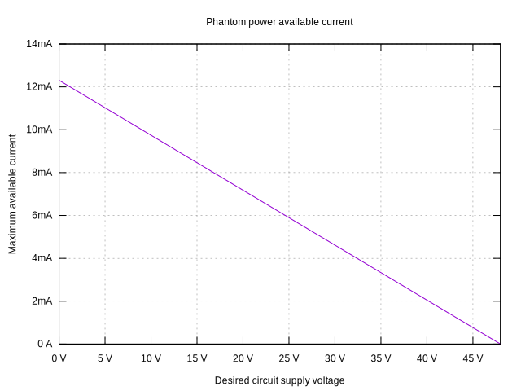
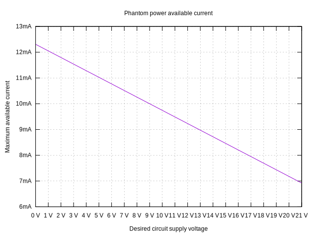

<script src="https://cdn.mathjax.org/mathjax/latest/MathJax.js?config=TeX-AMS-MML_HTMLorMML" type="text/javascript"></script>

# Active pickups for The Stick guitar

## Phantom power

Typical phantom power setup on the amplifier side:

- Pin 1 of XLR is Ground.
- Pins 2 and 3 of XLR are pulled up to 48V with 6.8K resistors.
- Typical input impedance for amplifiers is 1.5-2K or higher (citation needed).

### Choosing active pickup circuit voltage

Given the above description, the available current depends on desired voltage of the circuit:

$$ I(V) = (48 - V) / (6.8K \parallel 6.8K) $$

```gnuplot
set title "Phantom power available current"
set xlabel "Desired circuit supply voltage"
set ylabel "Maximum available current"
set grid
i(v) = (48-v)/(6.8e3/2)
plot [v=0:48] i(v) title ""
```



Let's zoom in on the more usable range:

```gnuplot
set xtics 1
plot [v=0:21] i(v) title ""
```


